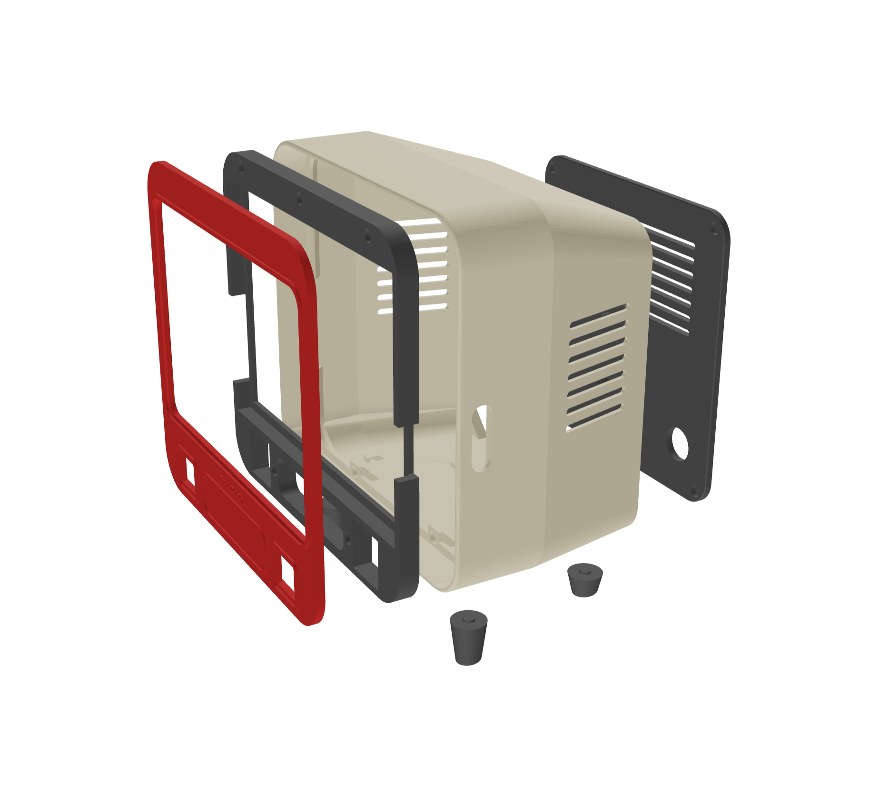

# TubeDeck build guide

A retro CRT-TV housing for a Raspberry Pi 4 and a 10.5" portable monitor. Nine 3D-printed pieces, held together with magnets; the only screws hold the Pi board.

> **Draft.** Each section below lists what is already known from the design work and what still needs to be filled in. Unchecked boxes are open items.

## Contents

1. [Overview](#1-overview)
2. [Parts & materials](#2-parts--materials)
3. [Tools](#3-tools)
4. [Printing](#4-printing)
5. [Test plate](#5-test-plate)
6. [Preparing the parts](#6-preparing-the-parts)
7. [Wiring](#7-wiring)
8. [Assembly](#8-assembly)
9. [Software setup](#9-software-setup)
10. [Troubleshooting](#10-troubleshooting)
11. [Customizing](#11-customizing)
12. [Files & license](#12-files--license)

---

## 1. Overview

**Status:** drafted · needs photos

TubeDeck is a tabletop retro game console styled like a small CRT television. Inside a 3D-printed housing it holds a Raspberry Pi 4 and a 10.5-inch portable monitor. You plug game controllers into four USB ports on the front, power the whole thing from a single USB-C connector on the back, and switch it on and off with a button on the left side.

The housing is designed to be printed on a consumer 3D printer with a 256 mm bed (it was built on a Bambu Lab A1), with no supports and without a multi-material system. Each part is printed separately, so each can be its own color. The parts are held together with magnets, so you can open the case again to reach the monitor, the Pi and the wiring.

> **Photo needed:** the finished TubeDeck, front three-quarter view.

### Why I built it

I wanted a fun, memorable way to spend time with my kids and play video games together, especially games that aren't available on today's consoles. A small TV-shaped console you can set on a table also works well for playdates and parties, where a group of kids can gather around one screen and take turns.

### At a glance

| | |
|---|---|
| **Size** | 255 mm wide × 150 mm deep × 240.6 mm tall, plus 14 mm feet (about 255 × 150 × 255 mm standing upright) |
| **Screen** | 10.5-inch portable monitor, visible area 225 × 152 mm, behind a rounded-corner window |
| **Computer** | Raspberry Pi 4, mounted on the inside of the rear cover |
| **Front connectors** | Four USB-A ports, in two dual-port panels either side of the speaker grille |
| **Rear connector** | One USB-C power input |
| **Power button** | On the left side, in a removable "tuning knob" collar; wired to the Pi for a safe shutdown |
| **Sound** | The monitor's built-in speakers, through the grille on the front |
| **Cooling** | Passive: louver vents in both side walls and in the rear cover |
| **Lean** | Upright, or tipped back by up to 15°, chosen when you generate or export the parts |
| **Printed pieces** | 9 (5 main parts plus 4 feet), plus an optional test plate |
| **Time** | About 29 hours of printing and about 1 hour of assembly |
| **Fasteners** | 26 magnets (8 × 3 mm), 4 heat-set inserts, glue. The only screws are the four that hold the Pi board. |
| **Printer needed** | Bed at least 256 × 256 mm. The shell fills a 256 mm bed, so it cannot be printed on a smaller one without changing the design. |

### The parts of the case

| Part | Qty | What it does |
|---|---|---|
| **Shell** | 1 | The main body. Its front section is straight, and the back tapers in like a picture tube. It has the side vents, the hole for the power button, four zip-tie loops on the floor for anchoring the front USB cables, sockets for the feet, and an internal ledge that the cradle rests on. |
| **Faceplate** | 1 | The front. It has the rounded screen window with a raised bead, the speaker grille, a raised frame around each USB panel, and the badge. It closes over the monitor. |
| **Cradle** | 1 | Sits behind the faceplate and holds the monitor in a pocket. It has cut-outs for the monitor's cables and buttons. |
| **Rear cover** | 1 | A plug that fits inside the rear opening and ends flush with the rim. The Pi bolts to its inside on four standoffs; it also has the USB-C power hole and the exhaust vents. |
| **Collar** | 1 | The "tuning knob" ring around the power button. It is a separate part, glued into a shallow groove, so it can be a contrast color. |
| **Feet** | 4 | Two front and two rear. When you choose a lean angle, the front feet are made taller. |

*Exploded view of the case. From left to right: faceplate (red), cradle, shell (beige) and rear cover, with two of the feet below. The colors are for illustration only.*

### Time

| Stage | Time |
|---|---|
| Printing, all parts | About 29 hours in total |
| Assembly | About 1 hour |

Print times for each part, measured on a Bambu Lab A1:

| Part | Print time |
|---|---|
| Shell | 10.8 hours |
| Rear cover | 6.1 hours |
| Faceplate | 6.0 hours |
| Cradle | 5.0 hours |
| Collar and four feet | 30 minutes together |

Your times will differ with your printer and slicer settings. Allow about 29 hours for everything, including warm-up and swapping plates between prints.

### How this guide is organized

Follow the sections in order the first time through:

1. [Parts & materials](#2-parts--materials) and [Tools](#3-tools): what to buy and have on hand.
2. [Printing](#4-printing) and the [Test plate](#5-test-plate): print the small test plate first, then the parts.
3. [Preparing the parts](#6-preparing-the-parts), [Wiring](#7-wiring) and [Assembly](#8-assembly): put it together.
4. [Software setup](#9-software-setup): get the Pi running the console.
5. [Troubleshooting](#10-troubleshooting), [Customizing](#11-customizing) and [Files & license](#12-files--license): if something goes wrong, to change the design, and where the files are.

### Open items for this section

- [ ] Photos: finished front, back and side

---

## 2. Parts & materials

**Status:** outline · needs your input

Everything to buy, with the dimensions the design depends on.

### Known so far

The links are the exact items used for the prototype. The dimensions in the notes come from those parts, so if you substitute something else, check it against the [test plate](#5-test-plate) first.

| Item | Qty | Notes | Source |
|---|---|---|---|
| 10.5" portable monitor | 1 | Body 236 × 168 × 9.5 mm; active area 225 × 152 mm. USB-C and mini-HDMI on the left edge, wheel and button on the right. | [moonka 10.5" portable monitor](https://www.amazon.com/dp/B0C7KPPXTZ) |
| Raspberry Pi 4 | 1 | Mounted on the rear cover, 58 × 49 mm hole pattern. | |
| Dual-port USB-A panel-mount extension cable | 2 | Flange 29 × 26 mm, body 18.7 mm wide, spring clips flare to 29.5 mm. Cut-out 25 × 22 mm (print-tested). | [BATIGE dual-port square USB 3.0 panel flush mount, with buckle](https://www.amazon.com/dp/B0BDWVFZKH) |
| Panel-mount USB-C power connector | 1 | Threaded barrel 23.58 mm. 24 mm hole (print-tested). Sold as a 2-pack, so one is spare. | [Nexarelle USB-C panel mount adapter with dust cover](https://www.amazon.com/dp/B0G42HQP9W) |
| 16 mm momentary push button | 1 | Wired to the Pi for a safe shutdown. | [16 mm momentary push button](https://www.amazon.com/dp/B0F62S67RS) |
| Right-angle USB-C cable, 1 ft | 1 | About 3.5 mm proud of the monitor edge. Power and data for the monitor. Sold as a 2-pack, so one is spare. | [DbillionDa USB-C to USB-C, 60 W, 90°](https://www.amazon.com/dp/B0CNT3ZCFR) |
| Right-angle mini-HDMI cable | 1 | About 3.5 mm proud of the monitor edge. | [JSER 90° down-angled FPV cable](https://www.amazon.com/dp/B01787RBUO) |
| USB-C Y splitter cable, 1 ft | 1 | Male to 2 × female, charging only. Splits the single power input between the Pi and the monitor — *confirm this is how it's wired*. | [Halokny USB-C Y splitter](https://www.amazon.com/dp/B0FKLTVTXJ) |
| Neodymium disc magnets 8 × 3 mm | 26 | 13 joints: 5 faceplate–cradle, 4 cradle–shell, 4 rear cover–shell. Pocket is 8.35 mm — *not yet print-tested*. Sold as a 160-piece assortment of 40 each of 8 × 3, 6 × 3, 5 × 3 and 3 × 3 mm, so the 8 × 3 mm size covers all 26 with 14 spare. | [rhinocats 160 pcs small magnets](https://www.amazon.com/dp/B0GK9VFB97) |
| Knurled insert nuts, M2.5 | 4 | For the Pi standoffs. 4.0 mm hole. Sold as a 100-pack. | [M2.5 knurled insert nuts, 100 pcs](https://www.amazon.com/dp/B0DPQJY2W8) |
| M2.5 screws | *4?* | *Length to confirm.* | *link to add* |
| Adhesive-base zip-tie mounts / zip ties | *?* | Optional: the printed shell has zip-tie loops for anchoring the front USB cables. | |

### To fill in

- [ ] Links for the M2.5 screws and zip-tie mounts
- [ ] The Raspberry Pi 4 model / RAM used
- [ ] The monitor's dimensions differ between brands: note the model number to match against
- [ ] USB-C power supply: a 47 W PD charger is known to run Pi + monitor; confirm the recommendation
- [ ] Filament: type, colors per part, and roughly how much (grams per part)
- [ ] Glue: which magnet glue and which for the collar and feet

---

## 3. Tools

**Status:** outline

### Likely list — confirm

- [ ] 3D printer with a 256 mm bed (built and tested on a Bambu Lab A1, no multi-material system)
- [ ] Soldering iron with a heat-set insert tip (for the four Pi standoffs)
- [ ] Calipers (for checking magnet and connector fits)
- [ ] Wire strippers / soldering for the button wiring
- [ ] Flat screwdriver or plastic pry tool (for the rear cover notch)
- [ ] Hobby knife, sandpaper

---

## 4. Printing

**Status:** facts collected · settings needed

How to print each part. No part needs supports when it is oriented as below.

### Known so far

| Part | Qty | Orientation | Print time (Bambu Lab A1) | Notes |
|---|---|---|---|---|
| Shell | 1 | Back rim down | 10.8 hours | 255 × 241 mm footprint, 150 mm tall — fills the whole bed. The rear cover's corner seats print as short bridges. |
| Faceplate | 1 | Back face down | 6.0 hours | Screen mask and control strip; raised details face up. |
| Cradle | 1 | Back face down (monitor pocket up) | 5.0 hours | 248 × 234 mm, about 13 mm tall. |
| Rear cover | 1 | Outer face down | 6.1 hours | Flush plug with the Pi standoffs facing up. |
| Collar | 1 | Flat | 30 minutes for the collar and all four feet together | Contrast color works well. |
| Front feet | 2 | Standing on the angled bottom face | Included above | Taller than the rear pair when the lean is above 0°. |
| Rear feet | 2 | Standing on the angled bottom face | Included above | |

> **Diagram needed:** each part in its print orientation on the bed.

### To fill in

- [ ] Slicer settings: layer height, walls, infill, speeds, nozzle
- [ ] Filament type and color per part
- [ ] Which STLs to download for a given lean angle, or how to export them
- [ ] Bridging notes: which surfaces to inspect after the shell print
- [ ] Photos of good and bad first layers on the shell

---

## 5. Test plate

**Status:** facts collected · text to write

Print this small plate first. It checks every hole that depends on your particular parts, before you commit to the big prints.

### Known so far

- Three USB-A panel widths (25, 26, 27 mm), the USB-C power hole, the power button hole with its collar groove, and magnet pockets.
- Magnet pockets at three diameters for each magnet size: 3.25 / 3.35 / 3.45 mm and 8.25 / 8.35 / 8.45 mm. The lower row opens on the bed side, where printed holes come out tighter; the upper row opens upward.
- Results so far: USB-A 25 mm and USB-C 24 mm fit; 3.35 mm fits 3 mm magnets (3.25 was too tight). *8 mm result pending.*
- Print it back face down; its collar is a separate small body.

### To fill in

- [ ] How to read the result and which value to change if a fit is wrong
- [ ] 8 mm magnet pocket result
- [ ] Photo of a finished test plate

---

## 6. Preparing the parts

**Status:** outline

Everything to do to the printed parts before assembly.

### Known so far

- Mark each magnet's polarity before gluing, so every mating pair attracts.
- Glue magnets flush: the pockets are 0.3 mm deeper than the magnets, so press each one level with the surface (a thin card shim or a drop of epoxy under it closes the gap).
- Press the four M2.5 heat-set inserts into the rear cover standoffs.
- The collar glues into a 1 mm groove around the button hole on the left wall.
- Feet glue into round sockets on the shell's underside, located by a short peg.

### To fill in

- [ ] Magnet layout diagram showing polarity for all 13 joints
- [ ] Insert temperature and technique
- [ ] Step-by-step photos
- [ ] Optional: felt or tape on the faceplate and cradle edges for a snug fit

---

## 7. Wiring

**Status:** outline · design questions open

How power and signals move through the case.

### Known so far

- One panel-mount USB-C connector on the rear cover, on the right as seen from the front, takes power in.
- A USB-C Y splitter (male to two female, charging only) is on the parts list to share that input between the Pi and the monitor. *Confirm the exact connection.*
- The power button is wired to the Pi's GPIO3 for a safe shutdown and wake-up.
- The monitor connects with a flat USB-C and a flat mini-HDMI cable along its left edge; the Pi drives it.
- The two dual-USB panels on the front connect to the Pi's USB ports; their stiff cables are anchored to the shell floor with zip ties.

### Open questions

- [ ] Confirm how the Y splitter is wired: which output goes to the Pi and which to the monitor, and whether the power supply can carry both
- [ ] Whether the monitor really needs PD or works from plain 5 V (inline USB-C meter test)
- [ ] Whether the monitor's volume wheel and power button stick out past its edge

> **Diagram needed:** power in → splitter → Pi / monitor; button → GPIO3 + GND; USB panels → Pi.

---

## 8. Assembly

**Status:** outline

The order to put everything together.

### Draft order — confirm against a real build

- [ ] Fit the feet
- [ ] Fit the power button and collar through the left wall
- [ ] Mount the Pi on the rear cover and connect the USB-C power lead
- [ ] Snap the USB panels into the faceplate
- [ ] Seat the cradle on the shell's internal ledge
- [ ] Plug the flat cables into the monitor, lay it into the cradle, close it with the faceplate
- [ ] Route the front USB cables and anchor them with zip ties
- [ ] Close the rear cover; to reopen it, lever it out through the notch in the bottom edge

> **Diagram needed:** exploded view with numbered steps.

---

## 9. Software setup

**Status:** not started

- [ ] Operating system and retro-gaming software used
- [ ] Screen resolution and display settings
- [ ] Safe-shutdown script for the button
- [ ] Controller setup

---

## 10. Troubleshooting

**Status:** started from real experience

### Lessons so far

- **USB panel won't go into the hole:** the snap-in clips are wider than the body. The cut-out has to be wider than tall (25 × 22 mm) and the plate is thinned to 3 mm behind it.
- **Magnets don't fit the pockets:** printed holes come out undersized. Use the test plate to pick the pocket size.
- **Faceplate keeps popping forward:** the stiff front-USB cables push on it. Anchor the cables to the shell floor with zip ties, and use the larger 8 mm magnets.
- **Rear cover slides off:** 3 mm magnets are too weak for the hanging cover; the design uses 8 mm magnets and a flush plug seat.
- **Power cable has no room behind the Pi:** the board sits high on the cover, leaving 50 mm below for the plugs.

### To add

- [ ] Anything else that goes wrong during the first full build

---

## 11. Customizing

**Status:** outline

- `TubeDeck.py` generates the parts in Fusion 360; `TubeDeck.scad` is the same design for OpenSCAD.
- Most dimensions are parameters at the top of each file: monitor size, USB and connector cut-outs, magnet and insert sizes, lean angle.

### To fill in

- [ ] How to run the Fusion script and what the dialog options do
- [ ] How to export STLs from OpenSCAD (`part` and `lean` settings)
- [ ] Adapting to a different monitor
- [ ] Changing the badge text

---

## 12. Files & license

**Status:** outline

- [ ] Where to download STLs (repository, MakerWorld, Printables)
- [ ] License
- [ ] Credits
- [ ] How to share your build
